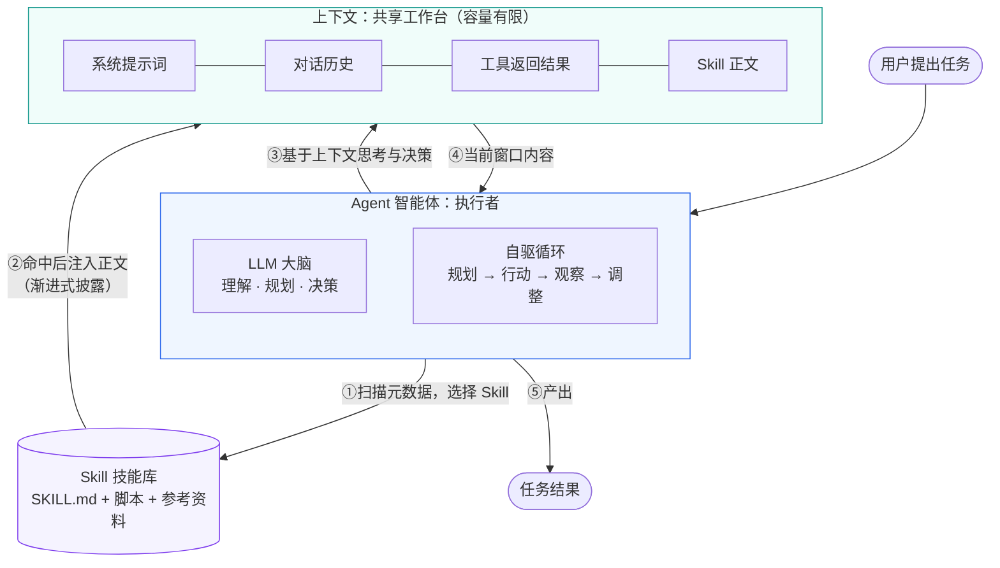
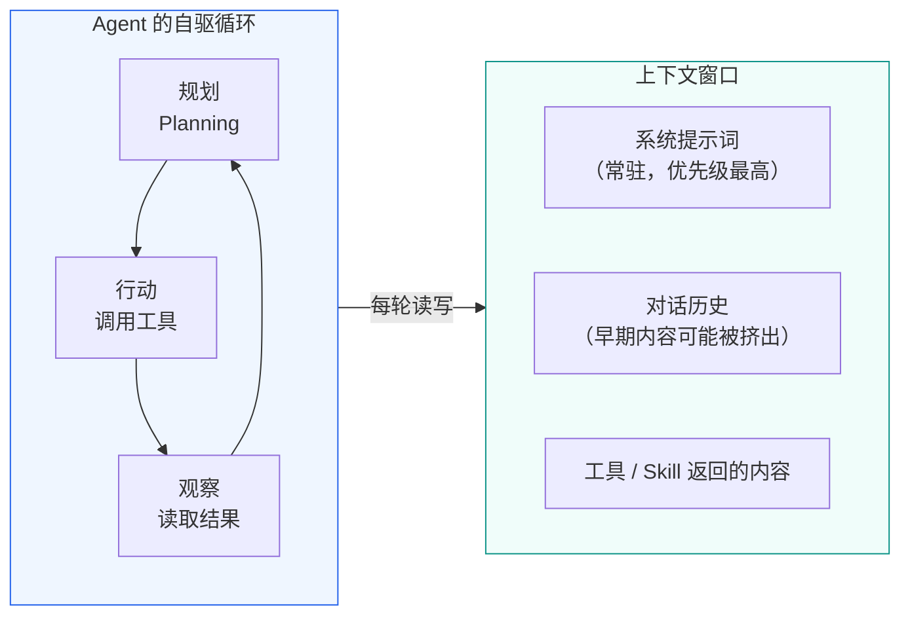
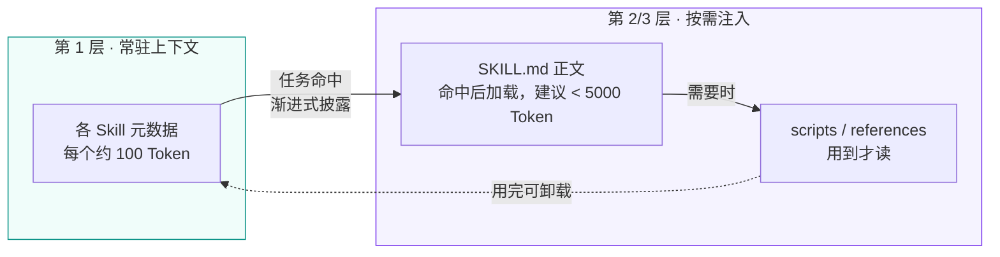

# Agent、上下文与 Skill 三者关系

> 本文档配合 `learning-materials/` 目录下的三份概念学习资料（`agent.html`、`llm-context.html`、`skill.html`）阅读，用 Mermaid 图 + 文字说明三者如何协作。

## 一、总览：一次对话里发生了什么

用户向 Agent 提出一个任务后，三者各司其职：**Agent 是执行者，Skill 是它调用的工作方法，上下文是它们共同的"工作台"**——Agent 的每一次思考、Skill 的每一页说明，都要摊在这块有限的工作台上进行。



**一句话分工**：Agent 决定"做什么"，Skill 告诉它"这类事该怎么做"，上下文则是它此刻"看得到的一切"。

## 二、Agent 与上下文：大脑与工作台

上下文是 Agent 的**短期工作记忆**。Agent 运行在自驱循环中，每一轮"思考 → 行动 → 观察"都发生在上下文里：



- **依赖关系**：Agent 完全依赖上下文工作——系统提示词（约束框架）常驻其中，规划与记忆以对话历史的形式存在，工具和 Skill 的产出也回填到这里。上下文被截断，Agent 就"失忆"。
- **反向约束**：正因为所有东西都挤在有限的窗口里，Agent 必须做上下文管理——裁剪无关历史、压缩中间结果，否则长任务会撑爆窗口。

## 三、Agent 与 Skill：员工与操作手册

Skill 是 Agent 的**可复用能力单元**。Agent 本身只知道"怎么思考"，Skill 补上"这类事的具体做法"：

```mermaid
flowchart TB
    U([用户："帮我总结这封邮件"]) --> Match{Agent 匹配<br/>Skill 元数据}

    Match -- 描述命中 --> Load[加载 email-summary Skill]
    Match -- 未命中 --> Direct[按通用能力直接处理]

    subgraph SK[email-summary Skill]
        direction TB
        M[YAML 元数据<br/>name + description<br/>约 100 Token，常驻]
        B[SKILL.md 正文<br/>步骤 · 约束 · 判断<br/>命中才加载]
        R[scripts / references<br/>按需读取，不占常驻空间]
    end

    Load --> SK
    SK -- 正文注入 --> Exec[Agent 按手册执行<br/>内部可编排多个工具调用]

    style SK fill:#f5f3ff,stroke:#7c3aed
    style Exec fill:#eff6ff,stroke:#2563eb
```

- **选择与被选择**：Agent 是主动方——扫描 Skill 的元数据、判断哪个适用、决定是否加载；Skill 是被动方——只是一组文件，自己不会运行。
- **层次关系**：Skill 内部可调用多个原子工具（Tool）。Tool 是"做这个动作"，Skill 是"知道何时、为何、如何组合这些动作"。
- **注意**：Skill 装得太多会让 Agent 在一堆相似描述里选错——能力清单本身也是要管理的上下文。

## 四、上下文与 Skill：工作台与按需取用的参考书

这是三者中最容易被忽视、也最精妙的一条关系：**Skill 的整个设计都是围绕"省上下文"展开的**。



- **Skill 没有自己的运行空间**：它的元数据和正文最终都要"注入上下文"才能被模型读到。Skill 是为上下文设计的打包格式。
- **渐进式披露（Progressive Disclosure）**：元数据常驻（第一层，约 100 Token/个）→ 正文命中才加载（第二层，建议 < 5,000 Token）→ 脚本和参考文档按需读取（第三层）。没有这套机制，装一百个 Skill 就等于把一百份说明书全部塞进上下文——窗口瞬间爆炸。
- **冲突的一面**：Skill 正文会挤占对话历史的空间，长任务中两者互相争夺窗口容量，需要 Agent 做取舍。

## 五、三者关系速查表

| 关系 | 一句话概括 | 关键机制 |
|------|-----------|---------|
| Agent ↔ 上下文 | 大脑 ↔ 工作台：Agent 只能基于当前上下文思考 | ReAct 循环、上下文管理 |
| Agent ↔ Skill | 员工 ↔ 操作手册：Agent 主动选用，Skill 被动等待 | 元数据匹配、按需加载 |
| 上下文 ↔ Skill | 工作台 ↔ 按需取用的参考书：Skill 一切内容最终注入上下文 | 渐进式披露（三层加载） |

## 六、总结类比

把三者放进一个厨房：<strong>Agent 是厨师</strong>（会思考、会尝味道、会调整火候），<strong>上下文是灶台台面</strong>（大小固定，摆满了就放不下新东西），<strong>Skill 是分类收纳的菜谱抽屉</strong>（平时只贴标签，做哪道菜才抽出哪本）。厨师的水平、台面的管理、抽屉的整理，三者共同决定了这顿饭做得好不好——缺一不可，也无法互相替代。

---

*检索日期：2026-09-05 · 事实依据见 `learning-materials/` 下三份资料各自的"来源链接"板块，关键论断（Anthropic 四组件框架、渐进式披露三层结构、ReAct 循环）均经多来源交叉验证，并经人工核查。*
